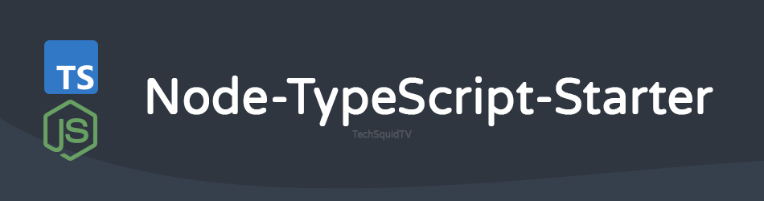

  

  A solid foundation for building modern Node.js applications with TypeScript, sink included.

  <!-- Add shields from https://shields.io/ -->
  
  
  
  

## Features ✨
- Pre-configured TypeScript setup
- Package management with NPM
- Build and Development scripts with watch mode
- Linting with ESLint and Prettier
    - Essential ESLint plugins for improved code quality
- Unit testing with Jest in TypeScript
- Automated dependency-free `.env`  injection
- Auto-build with `prepare` script
- Dockerfile for production deployment
- Docker Compose for local development
- GitHub Actions for CI/CD

## Getting Started 🌱
- Clone or download this repository to start a new Node.js project
- Run `npm install` to install all dependencies
- Create a `.env` file in the root of your project if needed
- Start the development server by running npm run `start:dev`
- Build your awesome Node.js application with TypeScript!

## Available Scripts 📜

- `npm run env:load`: Loads environment variables from the `.env` file
- `npm run clean`: Cleans the project by removing the `dist` directory
- `npm run build`: Builds the TypeScript project, outputting ES modules
- `npm run start`: Runs the compiled JavaScript application
- `npm run start:dev`: Starts the development server with live-reloading
- `npm run format`: Formats your code using Prettier
- `npm run lint`: Runs ESLint to check for code quality issues
- `npm run lint:fix`: Automatically fixes code quality issues using ESLint
- `npm run test`: Runs unit tests with Jest
- `npm run docker:build`: Builds a Docker image for production deployment
- `npm run docker:run`: Runs the Docker image in a container

## Contributing 🤝

Feel free to contribute to this project by opening issues or submitting pull requests. We appreciate any feedback and improvements to make this starter even better!

## License 📄

This project is licensed under the MIT License - see the [LICENSE](LICENSE) file for details.

---

Happy coding! 🎉